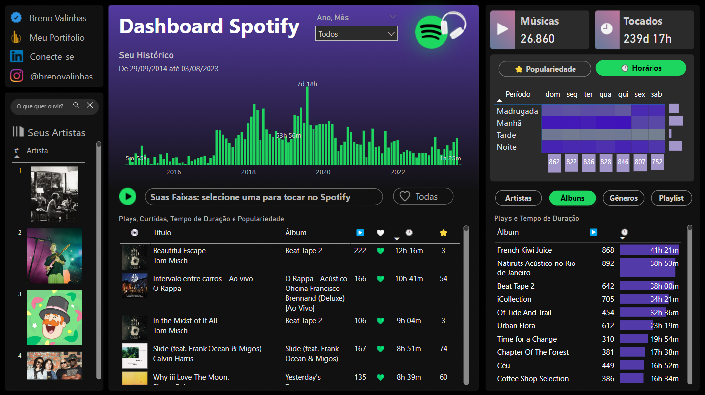
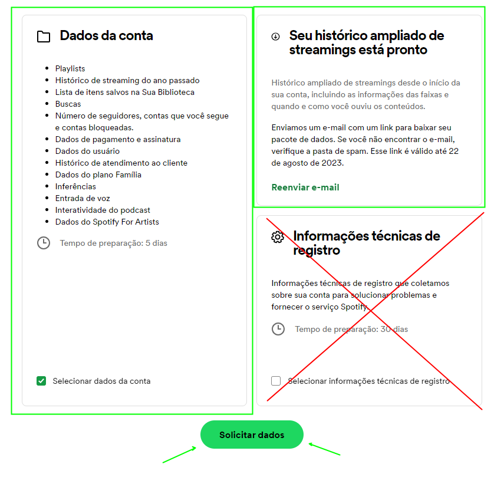
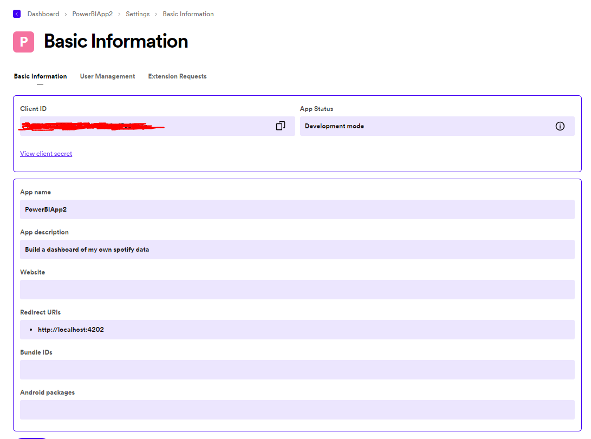

# Dashboard Power BI Spotify

Ao seguir essas etapas, você terá acesso completo ao seu histórico de streaming do Spotify, tanto simplificado quanto ampliado, permitindo uma análise profunda dos seus hábitos de escuta e preferências musicais.

[Acesse o Dashboard](https://app.powerbi.com/view?r=eyJrIjoiMWI1Y2ViNTAtZTEyYS00YjcyLWJlMGEtMTdjNGM5NTYzOTBjIiwidCI6IjlmODI2N2NmLWU1YTYtNGEwYy1hNWFhLWQ2MWIwNTBhZTBjYyJ9)

## Solicitando e Baixando Seus Dados do Spotify

### 1. **Acesse a Página de Privacidade do Spotify**
   - Acesse a [página de privacidade](https://www.spotify.com/br-pt/account/privacy/) do Spotify e faça login na sua conta.

### 2. **Solicite Seus Dados**
   - Na página de privacidade, você encontrará opções para solicitar diferentes tipos de dados associados à sua conta. Você pode solicitar os seguintes dados:
     - Playlists
     - Histórico de streaming do ano passado
     - Histórico ampliado de streamings
     - Lista de itens salvos na Sua Biblioteca
     - E outros dados relacionados à sua conta.

### 3. **Solicite o Histórico de Streaming Simplificado e Ampliado**
   - Clique em "Solicitar" na seção correspondente ao histórico de streaming do ano passado para o histórico simplificado.
   - Clique em "Solicitar" na seção correspondente ao histórico ampliado de streamings para obter informações detalhadas desde o início da sua conta.

### 4. **Aguarde o E-mail de Confirmação**
   - Após solicitar os dados, o Spotify enviará um e-mail com um link para baixar seu pacote de dados. A preparação dos dados pode levar algum tempo.
   - Se você não encontrar o e-mail, verifique a pasta de spam.

### 5. **Baixe os Arquivos**
   - Abra o e-mail e clique no link fornecido para baixar seus dados.
   - Os links são válidos apenas até a data especificada no e-mail (por exemplo, 13 de agosto de 2023 para os dados da conta e 22 de agosto de 2023 para o histórico ampliado de streamings).

### 6. **Extraia os Arquivos**
   - Os dados serão baixados como um arquivo ZIP contendo arquivos JSON.
   - Extraia o arquivo ZIP para acessar os arquivos JSON, que contêm seu histórico de streaming simplificado e ampliado.

Ao seguir essas etapas, você terá acesso completo ao seu histórico de streaming do Spotify, tanto simplificado quanto ampliado, permitindo uma análise profunda dos seus hábitos de escuta e preferências musicais.

## Utilizando a API do Spotify para Enriquecer os Dados

Ao extrair dados diretamente do Spotify, obtemos informações essenciais sobre o histórico de execução, como as faixas reproduzidas, os álbuns e os artistas. No entanto, esses dados, por si só, são relativamente limitados e não incluem elementos visuais, como imagens dos artistas e álbuns, nem métricas adicionais, como a popularidade da música.

### Por que utilizar a API do Spotify?

1. **Detalhamento Visual**: A API permite acesso às imagens dos artistas e álbuns. Essas imagens podem transformar um relatório analítico em uma experiência visualmente atraente, tornando os dados mais acessíveis e envolventes.

2. **Informações Adicionais**: Além das imagens, a API do Spotify fornece outras informações valiosas, como gêneros, popularidade das faixas e detalhes dos álbuns. Esses dados permitem uma análise mais profunda e permitem que os usuários explorem tendências, padrões e preferências de uma maneira mais significativa.

3. **Integração com Power BI**: Com essas informações adicionais, é possível criar um dashboard no Power BI que não apenas apresenta os dados brutos mas também os contextualiza e visualiza de maneira impactante. Isso permite uma compreensão mais clara e envolvente dos hábitos de escuta e das preferências musicais.

### Como criar uma App para acessar a API?

A criação de um aplicativo no Spotify Developer Dashboard é o primeiro passo para acessar essas informações adicionais. O aplicativo age como uma interface entre sua análise de dados e a API do Spotify, permitindo que você faça solicitações para extrair os detalhes desejados.

Em resumo, a utilização da API do Spotify, em combinação com a criação de um aplicativo, enriquece a análise dos dados do Spotify, transformando-a de uma simples revisão do histórico de execução em uma exploração visualmente rica e detalhada dos hábitos de escuta. Essa abordagem eleva a análise a um novo nível, permitindo insights mais profundos e uma apresentação mais envolvente dos dados.

### Criando um App

Para interagir com a API do Spotify e acessar os diversos recursos e informações disponíveis, é necessário criar um aplicativo em sua conta de desenvolvedor no Spotify. Essa etapa é crucial, pois fornecerá as credenciais de autenticação necessárias para fazer solicitações à API. Veja como você pode criar seu próprio aplicativo:

1. **Acesse o [Dashboard do Spotify Developer](https://developer.spotify.com/dashboard/create)**: Esta é a página onde você pode gerenciar todos os seus aplicativos Spotify.

2. **Clique em "Create an App"**: Aqui, você verá uma página solicitando informações sobre o aplicativo que deseja criar. 

3. **Preencha os Detalhes do Aplicativo**: Você precisará fornecer um nome para o aplicativo, uma descrição, e selecionar o tipo de aplicativo que está criando. Certifique-se de ler e aceitar os termos e condições.

4. **Defina os Redirect URIs**: Essa URL é usada durante o processo de autenticação e deve apontar para onde você deseja que os usuários sejam redirecionados após o login.

5. **Anote o Client ID e Client Secret**: Após a criação do aplicativo, você verá o Client ID e o Client Secret. Estas são as credenciais que você usará para autenticar suas solicitações à API. Mantenha-as em um local seguro.

6. **Configurações Adicionais (Opcional)**: Dependendo das suas necessidades, você pode ajustar outras configurações, como permissões, países disponíveis, etc.

Com seu aplicativo criado, você está pronto para começar a explorar a API do Spotify e desenvolver recursos interessantes para seus usuários. Certifique-se de seguir as diretrizes e práticas recomendadas de uso da API para garantir uma experiência suave e conforme as políticas do Spotify.

---